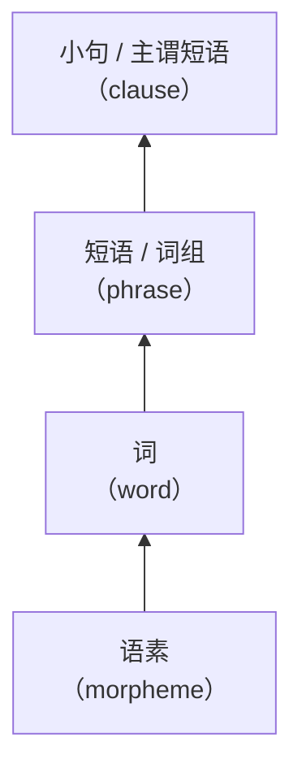

# 现代汉语（下）

*2022-03-02*

## 绪论

### 语法的界定

- 内涵
  - 语法现象（客观语法现象）
  - 语法学（研究语言语法规律的学科）
- 外延
  - 语言结构关系的整个系统
    - 广义：音系、形态 / 词法、句法、语义等
    - 狭义：组词、造句的规则，涉及部分语义、语用的内容



### 语法单位

- 词：最小的、能够独立活动的、有意思的语言单位
  - 词的内部结构：构词法
    - 单纯词、合成词
  - 词的外部功能：词类
- 短语
  - 内部结构：主谓、动宾、动补、偏正、联合、连谓
  - 整体功能：名词性、动词性、形容词性、副词性
- 句子
  - 内部结构：句型
    - 单句、复句
    - 简单句、复杂句、复杂句
  - 外部功能：句类
    - 陈述、疑问、祈使、感叹
  - 特殊的句子类型：句式
    - 把字句、被字句、双宾句、判断句

### 语法成分

- 主语、谓语；宾语；定语、状语；补语
- 层次分析

  ```mermaid
  flowchart
    a[我们]
    b[学校]
    c[逐步]
    d[加强]
    e[和]
    f[改进]
    g[对]
    h[大学生]
    i[的]
    j[管理]
    k[和]
    l[服务]
    m[工作]
  ```

### 课程目标

- 确定合法、不合法（* 表示）
  - a. 去了广州一趟 vs 去了一趟广州 \
    b. 叫了他一声 vs 叫了一声他 *
  - a. 三斤牛肉 vs 三斤的牛肉 \
    b. 三张纸 vs 三张的纸 *
- 发现并分化歧义
  - a. 山上架着炮 \
    b. 台上坐着主席团
- 为什么会有两种意义？
  - a. 中国女足谁都赢不了 \
    b. 中国男足谁都赢不了
  - 张三谁都认识

---

*2022-03-09*

### 现代汉语语法概述

#### 现代汉语形成历史

- 古代汉语
  - 上古：先秦—西汉
  - 中古：东汉—隋唐
- 近代汉语
  - 晚唐五代—清代中叶
- 现代汉语（吕叔湘：近代汉语的特殊阶段）
  - 清末至今

| | 古代汉语 | 近代汉语 | 现代汉语 |
|:-:|:-:|:-:|:-:|
| 动词短语 | 并列结构<br>射杀之 | 动补结构<br>射死他、射他死 | 动补结构<br>射死他 |
| 名词短语 | 之、此、彼、何 | 底、们、这、那、什么 | 的、们、这、那、什么 |
| 介词短语语序 | 苛政猛于虎<br>鸡栖于埘 | 苛政比老虎猛<br>在鸡窝栖息 | （同右） |
| 语音 | 有复辅音<br>浊音声母<br>入声 | 无复辅音<br>浊音开始清化<br>入声合并 | 无复辅音<br>浊音清化<br>入声消失 |

- 普通话基础方言的转变
  - 长安—汴洛—南京一带的南系官话——北京一带的北系官话
  - 自组织性
- 文言传统—白话书写

#### 语法的性质特点

- 异质有序的开放系统
  - 不同语法系统的相互影响：外语、方言
  - 不同语体存在较大差异：口语 vs 书面语
  - 语言系统无时无刻不处于变化之中
  - 结构层次性：组合关系、聚合关系
- 句子生成创造的无限性
  - 语法规律有限，而句子无限：无限递归性（recursiveness）

#### 现代汉语的异质性

- 方言的影响
  - 有 + VP：我每天都有喝旺仔牛奶
- 外来语的影响
  - 欧式语法
    - 人称代词首修饰：一个无家可归的可怜的我（赵元任）
    - 被字句中性化：被他夸了一通
  - 日式语法
    - VP + 中：准备中
- 语体差异
  - 书面语 vs 口语
    - 走向山顶 / 向山顶走
    - 山上架有一门大炮 / 山上架着一门大炮
    - 我校 / ~~我的校~~ / 我们学校
    - 他购买和安装了一套音像设备 / ~~他买和装了一套音像设备~~
  - 其他语体
    - 法律：对于外国人犯罪应当追究刑事责任**的**，……
    - 菜谱：**将**五花肉、鱿鱼圈和虾焯熟备用

#### 现代汉语语法的基本特点

- 什么是「特点」？
  - 需跳出「印欧语眼光」
- 形态手段匮乏，语序和虚词重要
- 词类和语法关系并不一一对应
- 语用凸显，对句法有重要影响
  - 话题非常发达：瓶子打破了
  - 允许主语省略：他过来，坐下，开始慢慢吃起来了
  - 量词重叠的语用限制
  - 音节凸显：过（于）难 / ~~过简单~~ / 过于简单 / 太（过）简单 / 太难 / ~~太过难~~
    - 动词偏好单音节：帮我扫（描）一下 / 帮我 P(S) 一下

#### 现代汉语语法研究历程

- 古代并没有真正意义的语法学
- 马建忠《马氏文通》（1898）
- 黎锦熙《新著国语文法》（1924）
- 陈望道、方光焘
  - 「文法革新」讨论
  - 模仿 or 自主
- 1940 年代的著作
  - 吕叔湘《中国文法要略》
  - 王力《中国现代语法》《中国语法理论》
  - 高明凯《汉语语法论》
- 建国到改革开放
  - 丁声树《现代汉语语法讲话》
  - 三次语法问题大讨论
    - 汉语词类划分
    - 主语、宾语区分
    - 单句、复句划界
- 西人的早期贡献
  - 胡安·柯伯（Juan Cobo）*Arte de la lengua China*（16 世纪）
  - 西班牙传教士万济国（Francisco Varo）《华语官话语法》（1703）

*2022-03-16*

## 词类

### 概况

- 划分词类的标准是什么？
- 词类划分：如何确定词类？
- 词类判定：某个词属于哪个词类？
- 如何处理兼类问题？

### 词类及划分标准

- 划分之困难
  - 词无形式标记及形态变化
  - 不同层次的成分混杂
  - 汉语词的多功能现象
  - 由于缺乏形态，有些句法结构的
- 核心问题：词类与句法成分不对应
  - 变词性
  - 增功能
- 划分标准
  - 语义标准
    - 词义与语法性质并不完全对应
    - 词义的可操作性不强
  - 形态标准
    - 派生形态（na-tion-al-ly）
    - 曲折形态（book/books, see/saw/seen, big/bigger, I/me/my/mine）
  - 句法标准（最合适）
    - 所能充当的句法成分，与其他成分的线性组合关系
    - 依据所有句法分布的总和
- 句法功能
  - 词充当句法成分的功能
    |  词类  | 主语 | 宾语 | 定语 | 状语 | 谓语 | 补语 |
    |:------:|:----:|:----:|:----:|:----:|:----:|:----:|
    |  名词  |   +  |   +  |   +  |      |   +  |      |
    |  动词  |   +  |   +  |      |      |   +  |   +  |
    | 形容词 |   +  |   +  |   +  |   +  |   +  |   +  |
    | 区别词 |      |      |   +  |      |      |      |
    |  副词  |      |      |      |   +  |      |      |
  - 词与词之间组合的功能
    - 名词前加「数词+量词」
    - 量词前加数词
    - 动词前加「不」，后带「了/着/过」
    - 形容词前加「很」
  - 词所具有的表示类别作用的功能
    - 数词：计数
    - 代词：指示
    - 连词：连接

### 词类划分与词性归属

- 词类划分
  - 马建忠《马氏文通》：名字、代字、动字、静字（形容词）、状字、介字、连字、助字、叹字
  - 吕叔湘《中国文法要略》：+语气词
  - 王力《现代汉语语法》：+数词
  - 丁声树等《现代汉语讲话》：+量词、象声词
  - 朱德熙《语法讲义》：形容词中独立出区别词，名词中独立出处所词、时间词
- 层级系统
  - 实词：能充当主语、宾语、谓语 / 能充当基本句法成分
  - 虚词
- 依据吕叔湘《汉语语法分析问题》分类
  - 开放类（open class）：名词、处所词、时间词、动词、形容词、区别词、副词（？）
  - 封闭类（closed class）：数词、量词、代词、介词、连词、助词、语气词、叹词、拟声词（？）

### 开放类词

#### 名词

- 用在数量词的后面，不能受「不」否定
- 语义：表示人、事物等的名称和抽象概念
- 语法特征
  - 经常充当主语、宾语
  - 多数名词可以直接作定语
  - 一般不作状语
    - 有处所功能的「名词 + 动词」：操场去、学校见
    - 名词 + 形容词，名词表示比喻：碗口粗、拳头大
    - 名词 + 动词性成分，使用某种途径做某事：电话采访、公费请客、武力镇压
  - 多数可以受数量结构的修饰
  - 一般不受副词的修饰
    - 对举：人不人，鬼不鬼
    - 有序名词：已经星期四了，快五一了，都大学生了
    - 修辞 vs 语法：不女人，很中国

#### 特殊类：处所词

- 能用在介词「在/到/往」后面，能用「哪儿」进行提问，能用「这儿/那儿」指代
- 包括地名、机构名、合成方位词
- 古汉语中名词可以直接作为处所，但现代汉语中其他名词必须要加方位词
- 单纯方位词（上） vs 合成方位词（上面）
  - 句法上，单纯方位词是黏着的，合成方位词是自由的
  - 单纯方位词不仅可以表示空间关系，还可以表示范围、条件等抽象关系（原则**上**、情况**下**）

#### 特殊类：时间词

- 能用在介词「在/到/往」后面，能用「什么时候」进行提问，能用「这个时候/那个时候」指代
- 时点用时间词（宋朝，今天）
- 时段/时量用数量结构

#### 动词

- 不受程度副词修饰的、或者能受程度副词修饰且能带表示支配、关涉对象宾语的谓词
- 表示动作行为、过程或判断


语法特征

- 多数可以后带「了/着/过」
- 多数可以受「不/没」否定
- 多数可以后加数量词表示动量和时量（看三遍）
- 多数可以受副词的修饰
  - 有些需要带宾语后才可用副词修饰

动词重叠

动词类别

- 及物、不及物
  - 及物：能够带表示支配、关涉对象的宾语
    - 体宾动词：只能带名词性宾语（**吃**饭，买衣服）
    - 谓宾动词：可以带动词性宾语（**能**来，**主张**进行调查，**觉得**很好）
      - 但也能带名词行宾语（**怕**他不来，**怕**蛇）
  - 不及物：可以带其他类型的宾语（准宾语）
    - 处所宾语：到北京
    - 存现宾语：来了个人
- 自主、非自主
  - 自主：能单独构成祈使句

特殊小类

趋向动词
- 能愿动词/助动词（能、应该、愿意）
  - 句法功能：只能带惟词性宾语
  - 不能带「了着过」
  - 可以放在「～不～」格式中
  - 不能重叠

#### 形容词

- 采取二分方式：形容词（性质/状态）、区别词
- 性质形容词
  - 能够受程度副词修饰，并且后加名词时不属于支配关系
  - 重叠
    - 单音节 AA：小小
    - 双音节 AABB：高高兴兴、快快乐乐、~~痛痛苦苦~~
    - 兼类（动词用 ABAB）：让我高兴高兴
    - 重叠之后句法类似状态形容词
- 状态形容词
  - 除性质形容词重叠外，其他构成方式
    - XX：皑皑、斑斑、勃勃
    - XY

*2022-04-06*

## 短语

- 短语 vs 词
- 短语 vs 句子
  - 短语：静态的备用单位，句子：动态的使用单位
  - 语音差异：语调、停顿
  - 句法差异：语序、语气词、插说成分

### 短语的结构、功能与类别

- 构成要素
  - 直接成分的类
  - 直接成分之间的结构关系
  - 结构整体的类
- 结构类型
  - 复合短语（实词+实词）
    - 基本类型
      - 主谓结构（陈述关系）：飞机起飞、他是学生
      - 偏正短语（修饰关系）：新书、我弟弟（定语+中心语），仔细研究、很新鲜（状语+中心语）
      - 动宾短语（支配关系）：洗衣服、来客人了（动作、行为），有人、下雨（状态、变化）
      - 动补短语（补充关系）：洗干净了、擦干净
      - 联合短语（并列关系）：北京上海、又便宜又好
      - 连谓短语（动词连用）：打电话去通知他、跑出去开门
      - 同位结构：首都北京、他们俩
    - 附加类型
- 功能类型
  - 体词（主宾语）：我的车、敌人的迫害
  - 谓词（谓语）：学语法、打死
  - 副词（状语）：从北京、飞快地

### 短语的分析方法

- 传统语法：句子成分分析法
- 结构主义：层次分析法
  - 每次只切分出直接组合的两个成分，逐层分析直到不能再切分为止
  - 每一个层级切分出来的两个直接组合的成分叫直接成分（immediate constituents）
  - 切分法（自顶向下）、组合法（自底向上）
  - 生成语法

### 层次分析的基本原则与步骤

- 基本原则
  - 结构原则：切分所得必须是合法的结构
    - 年轻的 | 一代，~~年轻 | 的一代~~
  - 搭配原则：切分所得彼此在意义上有搭配关系
    - 一片 | 好风光，~~一片好 | 风光~~
  - 意义原则：切分所得在意义上的组合与原来意思相同
    - 一位 | 小偷的辩护律师，~~一位小偷的 | 辩护律师~~
