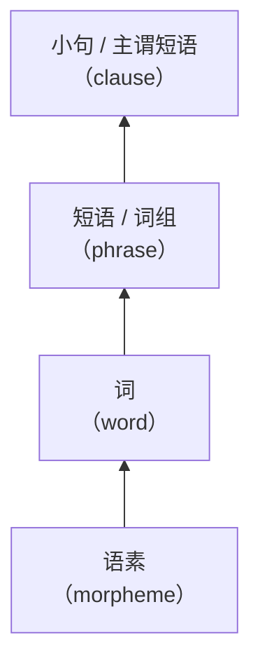

# 现代汉语（下）

*2022-03-02*

## 绪论

### 语法的界定

- 内涵
  - 语法现象（客观语法现象）
  - 语法学（研究语言语法规律的学科）
- 外延
  - 语言结构关系的整个系统
    - 广义：音系、形态 / 词法、句法、语义等
    - 狭义：组词、造句的规则，涉及部分语义、语用的内容



### 语法单位

- 词：最小的、能够独立活动的、有意思的语言单位
  - 词的内部结构：构词法
    - 单纯词、合成词
  - 词的外部功能：词类
- 短语
  - 内部结构：主谓、动宾、动补、偏正、联合、连谓
  - 整体功能：名词性、动词性、形容词性、副词性
- 句子
  - 内部结构：句型
    - 单句、复句
    - 简单句、复杂句、复杂句
  - 外部功能：句类
    - 陈述、疑问、祈使、感叹
  - 特殊的句子类型：句式
    - 把字句、被字句、双宾句、判断句

### 语法成分

- 主语、谓语；宾语；定语、状语；补语
- 层次分析

  ```mermaid
  flowchart
    a[我们]
    b[学校]
    c[逐步]
    d[加强]
    e[和]
    f[改进]
    g[对]
    h[大学生]
    i[的]
    j[管理]
    k[和]
    l[服务]
    m[工作]
  ```

### 课程目标

- 确定合法、不合法（* 表示）
  - a. 去了广州一趟 vs 去了一趟广州 \
    b. 叫了他一声 vs 叫了一声他 *
  - a. 三斤牛肉 vs 三斤的牛肉 \
    b. 三张纸 vs 三张的纸 *
- 发现并分化歧义
  - a. 山上架着炮 \
    b. 台上坐着主席团
- 为什么会有两种意义？
  - a. 中国女足谁都赢不了 \
    b. 中国男足谁都赢不了
  - 张三谁都认识

---

*2022-03-09*

### 现代汉语语法概述

#### 现代汉语形成历史

- 古代汉语
  - 上古：先秦—西汉
  - 中古：东汉—隋唐
- 近代汉语
  - 晚唐五代—清代中叶
- 现代汉语（吕叔湘：近代汉语的特殊阶段）
  - 清末至今

| | 古代汉语 | 近代汉语 | 现代汉语 |
|:-:|:-:|:-:|:-:|
| 动词短语 | 并列结构<br>射杀之 | 动补结构<br>射死他、射他死 | 动补结构<br>射死他 |
| 名词短语 | 之、此、彼、何 | 底、们、这、那、什么 | 的、们、这、那、什么 |
| 介词短语语序 | 苛政猛于虎<br>鸡栖于埘 | 苛政比老虎猛<br>在鸡窝栖息 | （同右） |
| 语音 | 有复辅音<br>浊音声母<br>入声 | 无复辅音<br>浊音开始清化<br>入声合并 | 无复辅音<br>浊音清化<br>入声消失 |

- 普通话基础方言的转变
  - 长安—汴洛—南京一带的南系官话——北京一带的北系官话
  - 自组织性
- 文言传统—白话书写

#### 语法的性质特点

- 异质有序的开放系统
  - 不同语法系统的相互影响：外语、方言
  - 不同语体存在较大差异：口语 vs 书面语
  - 语言系统无时无刻不处于变化之中
  - 结构层次性：组合关系、聚合关系
- 句子生成创造的无限性
  - 语法规律有限，而句子无限：无限递归性（recursiveness）

#### 现代汉语的异质性

- 方言的影响
  - 有 + VP：我每天都有喝旺仔牛奶
- 外来语的影响
  - 欧式语法
    - 人称代词首修饰：一个无家可归的可怜的我（赵元任）
    - 被字句中性化：被他夸了一通
  - 日式语法
    - VP + 中：准备中
- 语体差异
  - 书面语 vs 口语
    - 走向山顶 / 向山顶走
    - 山上架有一门大炮 / 山上架着一门大炮
    - 我校 / ~~我的校~~ / 我们学校
    - 他购买和安装了一套音像设备 / ~~他买和装了一套音像设备~~
  - 其他语体
    - 法律：对于外国人犯罪应当追究刑事责任**的**，……
    - 菜谱：**将**五花肉、鱿鱼圈和虾焯熟备用

#### 现代汉语语法的基本特点

- 什么是「特点」？
  - 需跳出「印欧语眼光」
- 形态手段匮乏，语序和虚词重要
- 词类和语法关系并不一一对应
- 语用凸显，对句法有重要影响
  - 话题非常发达：瓶子打破了
  - 允许主语省略：他过来，坐下，开始慢慢吃起来了
  - 量词重叠的语用限制
  - 音节凸显：过（于）难 / ~~过简单~~ / 过于简单 / 太（过）简单 / 太难 / ~~太过难~~
    - 动词偏好单音节：帮我扫（描）一下 / 帮我 P(S) 一下

#### 现代汉语语法研究历程

- 古代并没有真正意义的语法学
- 马建忠《马氏文通》（1898）
- 黎锦熙《新著国语文法》（1924）
- 陈望道、方光焘
  - 「文法革新」讨论
  - 模仿 or 自主
- 1940 年代的著作
  - 吕叔湘《中国文法要略》
  - 王力《中国现代语法》《中国语法理论》
  - 高明凯《汉语语法论》
- 建国到改革开放
  - 丁声树《现代汉语语法讲话》
  - 三次语法问题大讨论
    - 汉语词类划分
    - 主语、宾语区分
    - 单句、复句划界
- 西人的早期贡献
  - 胡安·柯伯（Juan Cobo）*Arte de la lengua China*（16 世纪）
  - 西班牙传教士万济国（Francisco Varo）《华语官话语法》（1703）
